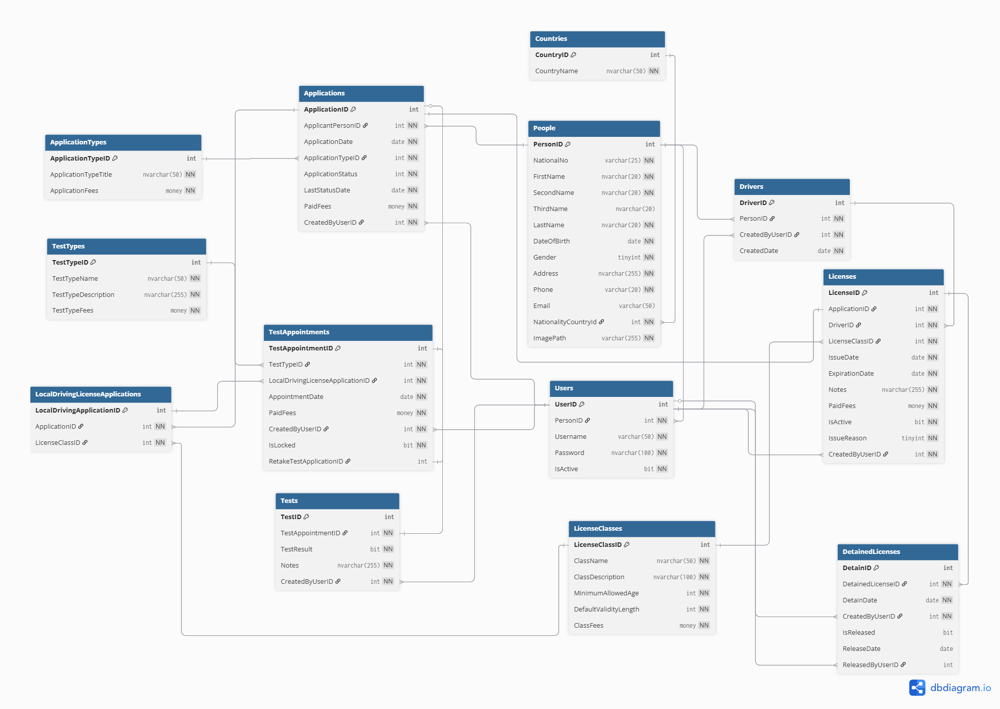
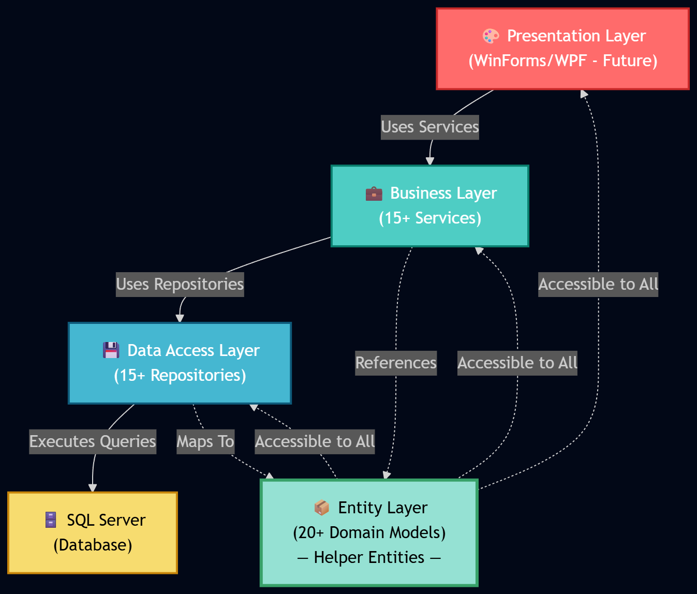

# 🚗 DVLD — Driver’s License Management System

  <b>Enterprise-grade licensing system built with clean architecture & C# best practices</b> 
  <i>Applications • Testing • Issuance • Tracking • Enforcement</i>

  
  
  
  

## 📌 Overview

**DVLD** is a full-stack system that manages the **entire lifecycle of driving licenses**, from application submission to license issuance and enforcement.

Built with a strong focus on:
- 🧱 Clean Architecture  
- 🔐 Security & Data Integrity  
- ⚙️ Maintainability & Scalability  

---

## 🖼️ Database Design & Architecture

  
  

## 🚀 Features

### 👤 User & Access Control
- Authentication & role-based authorization  
- Secure password management  
- User activation & tracking  

### 📋 Application Management
- New, Renewal, Replacement, International  
- Full lifecycle tracking  
- Fee calculation & validation  

### 🧪 Testing System
- Vision, Written, Practical tests  
- Appointment scheduling  
- Results tracking + retakes  

### 📜 License Management
- 7 license classes  
- Issuance, renewal, expiration  
- Driver record automation  

### 🌍 International Licenses
- Issuance & expiration tracking  

### 🛑 Detention & Release
- Fines, release workflow, audit trail  

## 🏗️ Architecture

DVLD is built using a **3-Tier Architecture** to ensure clear separation of concerns, maintainability, and scalability.

### 🔷 System Design
* Presentation Layer → UI (Planned: WinForms / WPF / Web)
* Business Layer → Business Logic & Validation
* Data Access Layer → Database Operations (SQL Server)

### 🧩 Layer Responsibilities

- **Presentation Layer**
  - Handles user interaction and UI rendering  
  - Communicates with the Business Layer  

- **Business Layer**
  - Contains core application logic  
  - Validates data and enforces business rules  
  - Acts as a bridge between UI and data  

- **Data Access Layer**
  - Handles all database operations (CRUD)  
  - Uses parameterized queries for security  
  - Manages connections and data retrieval  

## 🚀 Getting Started
- `git clone https://github.com/mahmouddello/DVLD.git`
- `cd DVLD`

## Setup
- Download and restore the database.
- Configure connection string in `DataAccessSettings.cs`
- Open solution in Visual Studio
- Build the project

## 💡 What This Project Demonstrates
- Scalable system design
- Clean architecture implementation
- Complex business logic handling
- Secure coding practices

## 👨‍💻 Author
<b>Mahmoud Dello</b>
- GitHub: https://github.com/mahmouddello
- LinkedIn: https://linkedin.com/in/mahmoud-dello

 

    
Happy Coding 💻🎉

